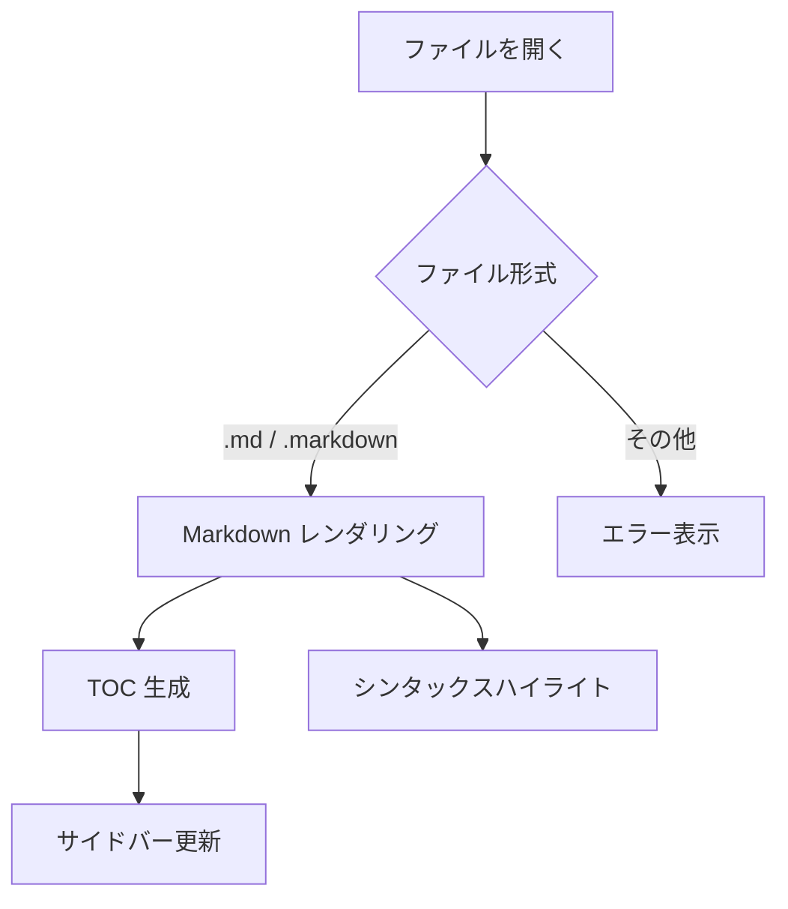
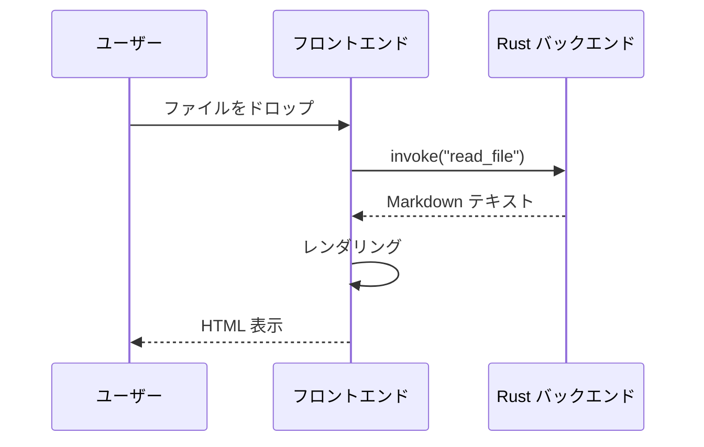
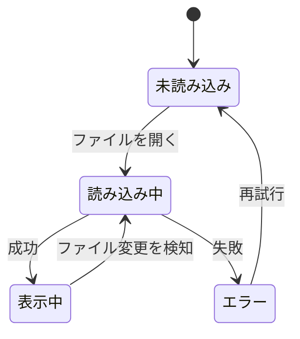

# Markdown 表示サンプル

このファイルは Markdown Viewer の表示確認用サンプルです。  
基本的な記法から拡張記法まで、一通りの要素が正しくレンダリングされるかを確認できます。

---

## 目次

- [テキスト装飾](#テキスト装飾)
- [見出し](#見出しサンプル)
- [リンク・画像](#リンク画像)
- [リスト](#リスト)
- [タスクリスト](#タスクリスト)
- [コードブロック](#コードブロック)
- [引用](#引用)
- [テーブル](#テーブル)
- [水平線](#水平線)
- [脚注](#脚注)
- [HTML 混在](#html-混在)
- [自動リンク](#自動リンク)

---

## テキスト装飾

通常のテキスト。**太字（Bold）**、*斜体（Italic）*、***太字斜体（Bold Italic）***。  
~~打ち消し線（Strikethrough）~~、`インラインコード`。

キーボード入力の表現: <kbd>Ctrl</kbd> + <kbd>Shift</kbd> + <kbd>P</kbd>

Typographer 変換（`typographer: true`）:  
- 引用符: "Hello World" → "Hello World"  
- ダッシュ: --- → —（em dash）  
- 省略: ...  → …

---

## 見出しサンプル

# 見出し H1
## 見出し H2
### 見出し H3
#### 見出し H4
##### 見出し H5
###### 見出し H6

---

## リンク・画像

[インラインリンク（外部）— クリックするとブラウザで開く](https://github.com/markdown-it/markdown-it)

[参照スタイルリンク][ref-link]

[ref-link]: https://tauri.app/

ページ内アンカーリンク: [目次へ戻る](#目次)

自動リンク（linkify）: https://svelte.dev

画像（代替テキストのみ・ローカル画像なし）:


---

## リスト

### 順序なしリスト

- 項目 A
- 項目 B
  - ネスト 1 階層目
  - ネスト 1 階層目（2 番目）
    - ネスト 2 階層目
- 項目 C

### 順序付きリスト

1. 最初のステップ
2. 次のステップ
   1. サブステップ 1
   2. サブステップ 2
3. 最後のステップ

### 定義リスト（HTML 拡張）

<dl>
  <dt>Tauri</dt>
  <dd>Rust + WebView2 を使ったデスクトップアプリフレームワーク</dd>
  <dt>Svelte</dt>
  <dd>コンパイル時最適化を行うフロントエンドフレームワーク</dd>
</dl>

---

## タスクリスト

- [x] Tauri v2 プロジェクトセットアップ
- [x] Markdown レンダリング実装
- [x] ダークモード対応
- [x] TOC（目次）スクロールスパイ
- [x] 外部リンクをブラウザで開く
- [ ] キーワード検索
- [ ] フォルダ内ファイル一覧
- [ ] GitHub URL 対応

---

## コードブロック

### インラインコード

変数 `const greeting = "Hello"` や関数 `console.log()` などをインラインで記述できます。

### シンタックスハイライト（TypeScript）

```typescript
interface MarkdownViewerConfig {
  darkMode: boolean;
  contentPadding: number;
  sidebarOpen: boolean;
}

async function loadFile(path: string, config: MarkdownViewerConfig): Promise<string> {
  const content = await invoke<string>("read_file", { path });
  return content;
}
```

### Rust

```rust
#[tauri::command]
fn list_md_files(dir: String) -> Result<Vec<String>, String> {
    let mut files: Vec<String> = std::fs::read_dir(&dir)
        .map_err(|e| e.to_string())?
        .filter_map(|e| e.ok())
        .filter(|e| e.file_type().map(|t| t.is_file()).unwrap_or(false))
        .filter(|e| {
            let name = e.file_name().to_string_lossy().to_lowercase();
            name.ends_with(".md") || name.ends_with(".markdown")
        })
        .map(|e| e.path().to_string_lossy().into_owned())
        .collect();
    files.sort();
    Ok(files)
}
```

### JSON

```json
{
  "identifier": "default",
  "windows": ["main"],
  "permissions": [
    "core:default",
    "opener:default",
    "dialog:default"
  ]
}
```

### Shell

```bash
# Tauri アプリの開発起動
export CARGO_INCREMENTAL=0
cargo tauri dev -- -- path/to/file.md
```

### ハイライトなし（プレーンテキスト）

```
plain text block
no syntax highlighting applied here
```

---

## 引用

> 単一行の引用文。

> 複数行の引用文。  
> 2 行目も引用スタイルで表示される。
>
> 段落を分けることもできる。

> **ネストされた引用**
>
> > 2 階層目の引用
> >
> > > 3 階層目の引用

引用内にコードブロックを入れることもできる:

> 以下のコマンドでビルドする:
>
> ```bash
> pnpm build
> ```

---

## テーブル

| 機能 | Phase 1 | Phase 2 | Phase 3 |
|:---|:---:|:---:|:---:|
| Markdown レンダリング | ✅ | ✅ | ✅ |
| ダークモード | ✅ | ✅ | ✅ |
| TOC / スクロールスパイ | ✅ | ✅ | ✅ |
| 外部リンク（ブラウザ） | ✅ | ✅ | ✅ |
| ← → 履歴ナビゲーション | ✅ | ✅ | ✅ |
| キーワード検索 | ❌ | ✅ | ✅ |
| フォルダファイル一覧 | ❌ | ✅ | ✅ |
| マージン調整 | ❌ | ✅ | ✅ |
| Mermaid 図 | ❌ | ❌ | ✅ |
| KaTeX 数式 | ❌ | ❌ | ✅ |

### 左揃え・右揃え・中央揃え

| 左揃え | 右揃え | 中央揃え |
|:---|---:|:---:|
| Left | Right | Center |
| テキスト | 1,234 | 中央 |

---

## 水平線

3 種類の記法、いずれも同じ水平線を生成:

---

***

___

---

## 脚注

脚注は文書内の任意の場所に参照を置き[^1]、文末に本文を定義します[^note]。

[^1]: これが脚注 1 の本文です。
[^note]: 脚注には名前付きラベルも使えます。複数行にわたることもできます。

---

## HTML 混在

`html: true` のため、生 HTML タグをそのまま埋め込めます。

<details>
<summary>クリックで展開（HTML の details/summary タグ）</summary>

この中身は折りたたまれています。  
**Markdown もレンダリングされます。**

```javascript
console.log("details の中身");
```

</details>

<br>

カラーテキスト（CSS インラインスタイル）:  
<span style="color: #0969da;">青いテキスト</span>、<span style="color: #cf222e;">赤いテキスト</span>

警告ボックス風:

<div style="padding: 12px 16px; background: #dff0d8; border-left: 4px solid #3c763d; border-radius: 4px; margin: 8px 0;">
  ✅ <strong>成功</strong>: すべてのテストがパスしました。
</div>

<div style="padding: 12px 16px; background: #fcf8e3; border-left: 4px solid #8a6d3b; border-radius: 4px; margin: 8px 0;">
  ⚠️ <strong>警告</strong>: この操作は取り消せません。
</div>

---

## 自動リンク

`linkify: true` により URL が自動でリンクに変換されます:

- https://github.com
- https://tauri.app
- https://svelte.dev

メールアドレスは変換されません（セキュリティ上の理由）。

---

## Markdown 記法まとめ（Plain Text 確認）

```markdown
# 見出し H1
## 見出し H2

**太字** *斜体* ~~打ち消し~~

- リスト項目
- [ ] タスク未完了
- [x] タスク完了

| 列1 | 列2 |
|-----|-----|
| A   | B   |

> 引用文

`インラインコード`

[リンクテキスト](URL)
```

---

## 数式（KaTeX）

インライン数式: $E = mc^2$、$\pi \approx 3.14159$

ピタゴラスの定理: $a^2 + b^2 = c^2$

ブロック数式（ガウス積分）:

$$
\int_{-\infty}^{\infty} e^{-x^2} dx = \sqrt{\pi}
$$

二項式の展開:

$$
(x + y)^n = \sum_{k=0}^{n} \binom{n}{k} x^{n-k} y^k
$$

オイラーの等式:

$$
e^{i\pi} + 1 = 0
$$

---

## Mermaid 図

### フローチャート



### シーケンス図



### 状態遷移図



---

*このファイルは Markdown Viewer の動作確認専用です。*
